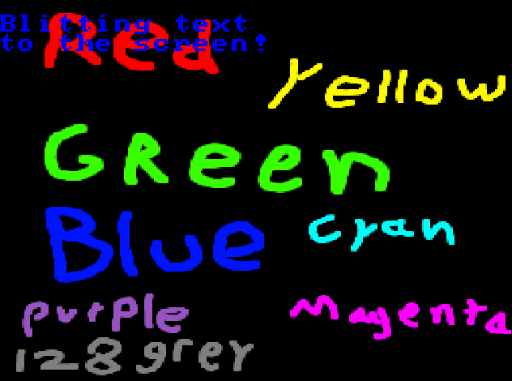
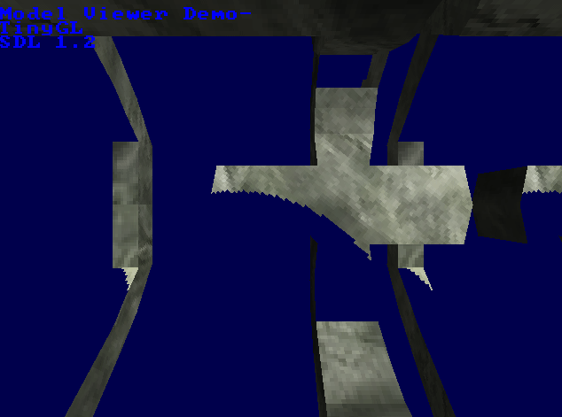

# TinyGL fork


A comprehensive overhaul of [TinyGL](https://bellard.org/TinyGL/) as a better software rasterizer.
It is a small, software-only and partial GL 1.1 implementation wth limited multithreading support.

The original project was by [Fabrice Bellard](https://bellard.org/). We have forked it. 

## Architecture

TinyGL is made up 3 major modules:
- Mathematical routines (zmath).
- OpenGL-like emulation (zgl).
- Z buffer and rasterisation (zbuffer).

## Safety features

TinyGL contains the following safety features:
1. compiletime options for `glGetError()` functionality which obviously slows down speed but increases debugging capability.
2. OpenGL 2.0 buffers, for easy memory management (Anything you put in a buffer using glBufferData will be free'd upon `glClose()`)
3. Fully leak checked using Valgrind- The only leaks you'll see are from your system's SDL. the Raw demos have zero leaks.

## Incredibly portable

TinyGL is written in pure C99, and requires very few functions from the C standard library, it doesn't even require malloc and free
(The calls are aliased to `gl_malloc()` and `gl_free()`, which you can replace with your own memory management model if you desire)

## Portability

You can test compiling TinyGL by executing `make raw-examples`, which do not require ANYTHING Except the C standard library and stdio.

These are the C standard library includes used in the raw examples.
```c
#include <math.h>
#include <stdio.h>
#include <stdlib.h>
#include <string.h>
#include <stdarg.h>
```

If your system supports it, the library can also take advantage of `alignas` to get improved SIMD support,
which can be disabled in zfeatures.
This adds a dependency to `<stdalign.h>` but greatly increases vertex processing speed.
(This is disabled by default for maximum portability)

If you are unsure if your target platform can support TinyGL, compile it with the buildtime and runtime tests enabled (They are, by default)

if you get a `TGL_BUILDT` error, then you've failed the buildtime test.

if you try to initialize the library and you get a crash with a print to standard out `TINYGL_FAILED_RUNTIME_COMPAT_TEST` then you've failed the runtime test.

The SDL examples have been tested building on Debian 10 and Windows 10, while tinygl itself has been confirmed to compile on many more platforms.

## Status

There are graphical artifacts visible in these gifs which have been corrected in this version of the library.

Without Polygon Stipple:


With Polygon Stipple:


Hello World test:


Texturing Test: 


Model loading tests:


Without lighting: 


This is a demo of the `NO_DRAW_COLOR` feature. Notice that the object appears to have a hole in it.


Blending:


Specular:


Notable changes:
* Disabled 8, 15, and 24 bit rendering modes. 16 and 32 are the only supported rendering modes (Coincidentally, they are also the fastest)
* Allowed the fixed texture size to be changed at compile time. It must be a power of 2, but that is the only limitation.
* Removed the entire GLX/NanoGLX part of the library. Not portable and mostly useless.
* Implemented new functions and some more of GL 1.1's prototypes including polygon stipple.
* Triangles can now be lit and textured at the same time!
* Removed unused functions which bloat binary size and lengthen compile times.
* Added support for glDepthMask and glDisable(`GL_DEPTH_TEST`) as per-GL-spec
* ADDED BLENDING SUPPORT!
* Added glDrawPixels
* Added glPixelZoom
* Added glRasterPos2f,3f,4f,2fv,3fv,4fv
* Added glGetString() for `GL_VENDOR`, `GL_RENDERER`, and `GL_VERSION`
* Added comprehensive, usable glGetError() functionality for debugging.
* Fixed clientside arrays
* Tuned the triangle rasterizer to near-perfection.
* Tuned the transformations to absolute perfection
* Added glDrawArrays
* Added Buffers (For memory management purposes)
* Added glTexImage1D (... it just resizes it to 2D, but it works!)
* Added glPixelSize (TODO is to implement distance scaling)
* Fixed specular rendering
* Added way more compile time options
* Fixed all the memory leaks.
* added Openmp multithreading and glPostProcess()
* Line rendering now obeys glDepthMask and glDepthTest.
* Implemented glRectf
* Implemented compiletime toggles for `GL_SELECT` and `GL_FEEDBACK` which significantly boosts performance. Also, implemented `GL_FEEDBACK`.

Note that this softrast **is not GL 1.1 compliant** and does not constitute a complete GL implementation.

Notable limitations:
* The only supported texture size and format is decided at compile time. you can set it in zfeatures.h
* A lot of prototypes are missing.
* glPolygonOffset doesn't change anything about how rendering occurs. It does nothing, at the moment. 
The "implementation specific multiplier" is 0.
* There is no stencil buffer.
* Blending can't use alpha values. the rasterizer has no concept of alpha.
* There is no mipmapping, antialiasing, or any form of texture filtering.
* No edge clamping. S and T are wrapped.
* Display lists can be infinitely nested and doing so will crash TinyGL.
* Lit triangles will use the current material properties, even if they are textured.
  - If the diffuse color is black, then your
textured triangles will appear black.
* Textured triangles are affected by their vertex colors- the per-vertex color is used as a "mask" for the texture on triangles.
  - It is recommended you call glColor3f(1,1,1); before rendering a textured object to get the expected result you only need to make this call once, and it can be before glBegin.
* the X dimension of the rendering window with must be a multiple of 4.
* Line rendering is not blended
* The ARB extension for point sprite size attenuation is not enabled.
* Point smoothing is not implemented, points are always squares of a solid color.
* glCopyTexImage2D only works with the size of texture you decided at compile time.

## Integrations

TinyGL is not header only, it is a combination of C files, internal headers, and external headers.
The internal headers are only used while compiling the library,
the external headers (gl.h, zfeatures.h, zbuffer.h) are required to use the library.
You CAN compile the library along with your final program into a single compilation unit without separating out the library.

This is how you use TinyGL in a program:
```c
#include <GL/gl.h>
#include "zbuffer.h"

/* Next, open a framebuffer.
 * The "0" parameter is where you pass in a framebuffer pointer if you've already made one.
 */
ZBuffer *frameBuffer = ZB_open(winSizeX, winSizeY, mode, 0);

/* Tell TinyGL to initialize on that framebuffer */
glInit(frameBuffer);

/* Begin making TinyGL calls! */

/* Update framebuffer when you want to copy to your target screen
 * Pitch is the width of the target in bytes, or bytes per pixel times width;
 */
ZB_copyFrameBuffer(frameBuffer, screen->pixels, screen->pitch);

/* At the end of your application, when you want to clean up. */
ZB_close(frameBuffer);
glClose();
```

Note that while you... *can* invoke `ZB_Resize` to resize the framebuffer, you really shouldn't. It isn't tested.

### Minimum requirements

SDL2 is required to run most of the `sdl_examples`, but SDL is by no means required to compile or use this library.
SDL is used as a reasonable means of displaying the output of TinyGL for testing.

Requirements
* A C99 compliant compiler
* 32 bit signed and unsigned integer types
* 32 bit binary float type (`STDC_IEC_559`)
* Some floating point type at least as large as a 32 bit float
* sin and cos functions in math.h
* memcpy in string.h
* assert in assert.h (for debugging only, it can be stubbed)
* a minimal C stdlib
* A memory allocator of some sort with some equivalents or replacements for malloc, calloc, and free.

There is no FILE* usage, or I/O outside of 'msghandling.c' so if you want to remove all stdio dependency, just stub out the calls there.

### Multithreading support

OpenMP is used on supported platforms to multithread certain operations.
These are the operations that are accelerated by multithreading:
* glDrawPixels
  - Every scanline is drawn by a separate thread.
* glPostProcess
  - Every call of the function pointer is run by a separate thread.
* glCopyTexImage2D
  - Every scan line is copied by a separate thread.
* ZBCopyBuffer
  - Every scan line is copied by a separate thread.

Compile the library with `-fopenmp` to see them in action (default). They are used in the texture demo, make sure to add the argument `-pp`

You do not need a multithreaded processor to use TinyGL!

## New functions

These are functions not in the GL 1.1 spec that we haved added to make this library more useful.
These functions cannot be added as opcodes to display lists unless specifically listed.

### glDeleteList
An easier to use version of glDeleteLists. glDeleteLists is also implemented.

### glSetEnableSpecular(int shouldenablespecular);
This function can be added to display lists.

Allows you to configure specular rendering. Turn it off
if you want to use GL_LIGHTING but don't plan on using
specular lighting. it will save cycles.

### glGetTexturePixmap(int text, int level, int* xsize, int* ysize)
Allows the user to retrieve the raw pixel data of a texture, for their own modification.

### glDrawText(const unsigned char* text, int x, int y, unsigned int pixel)
This function can be added to display lists as glPlotPixel calls, the text is not saved in a display list.

Is capable of rendering the entire 8 bit latin extended character set (7 bit ascii plus characters 0xa0 and onward...)
You can check how to embed non-standard characters in your strings in the gears demo.
Draws a pre-made 8x8 font to the screen. You can change its displayed size with...

### glTextSize(GLTEXTSIZE mode)
This function can be added to display lists.

Set size of text drawn to the buffer in aforementioned function.

### glPlotPixel(int x, int y, unsigned int pixel)
This function can be added to display lists.

Plot pixel directly to the buffer.

### glGenBuffers, glDeleteBuffers, glBindBuffer (valid target: `ARRAY_BUFFER`), glBindBufferAsArray
Serverside buffers! Makes it a bit easier to do clientside array stuff at the moment. 
may be the site of future hardware acceleration.

Please look at the model.c demo to see how to use these functions. They function very similarly to their GL 2.0+ counterparts.

### glPostProcess(GLuint (*postprocess)(GLint x, GLint y, GLuint pixel, GLushort z))
Fast, Multithreaded Postprocessing for TinyGL. 

You simply send in a function pointer (The function's name) and glPostProcess does the heavy lifting
The return value is the pixel (ARGB or 5R6G5B depending on mode).

x and y are the screen coordinataes.

pixel is the current color value of the pixel, ARGB or 5R6G5B depending on mode.

z is TinyGL's internal Z buffer representation. Larger values are considered to be "in front" of smaller ones.

This function is multithreaded on supported platforms for maximum execution speed. It of course still works without multithreading, but

it will not be as fast.

Note that you may have to take special care to prevent race conditions when using multithreading with this function.

### New glGet calls
You can query glGetIntegerV with these new definitions
```c
	GL_POLYGON_MAX_VERTEX = 0xf001,
	GL_MAX_BUFFERS = 0xf002,
	GL_TEXTURE_HASH_TABLE_SIZE = 0xf003,
	GL_MAX_TEXTURE_LEVELS = 0xf004,
	GL_MAX_SPECULAR_BUFFERS = 0xf005,
	GL_MAX_DISPLAY_LISTS = 0xf006,
	GL_ERROR_CHECK_LEVEL = 0xf007,
	GL_IS_SPECULAR_ENABLED = 0xf008,
```

to query the configuration of TinyGL.

## Configurable build-time features

See `include/zfeatures.h`

This changes too often to maintain documentation here.

The compiletime test is now disabled by default since it may not be "liked" by some obscure compilers...
you can enable it in `<GL/gl.h>`

```c
/* at the top of include/GL/gl.ha */
#define COMPILETIME_TINYGL_COMPAT_TEST 1
```

## Fully compatible with RGBA

The library is now able to be configured properly for RGBA rendering. Note that the output *is actually ARGB* 
but adjusting it is easy, see the SDL examples.

The library is sometimes by default configured for RGBA or 5R6G5B, check include/zfeatures.h and change the values in this table:
```c
#define TGL_FEATURE_8_BITS         0
#define TGL_FEATURE_24_BITS        0
#define TGL_FEATURE_16_BITS        1
#define TGL_FEATURE_32_BITS        0
```

make sure that only ONE of these values is 1.

## Related Projects
* [PortableGL](https://github.com/rswinkle/PortableGL) is an implementation of OpenGL 3.x core in clean C99 as a single header library.
* [TinyGLES](https://github.com/lunixbochs/tinygles) is a software OpenGL ES driver.
* [Vincent ES](https://github.com/hmwill/GLESv20) is a software renderer based on OpenGL ES 2.0 API.
* [softgl](https://github.com/bit-hack/softgl) is a software renderer based on OpenGL 1.x.
* [TinyGL.js](https://github.com/humu2009/tinygl.js) is based upon TinyGL's implementation written in C and compiled to JavaScript via Emscripten. It only uses software rasterization and does not require WebGL to run.
* [scummvm/graphics/tinygl](https://github.com/scummvm/scummvm/tree/master/graphics/tinygl) contains a series of aggressive modifications against the original TinyGL.
